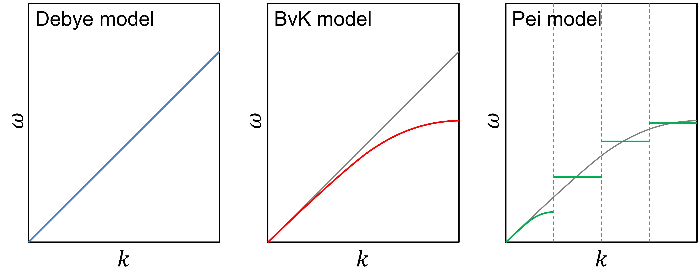

# kappamin
A python3 code for calculations of the minimum limit to thermal conductivity



## Features

- Models of the minimum limit to thermal conductivity under Cahill assumption[^1]
  - Debye model[^2]
  - BvK (Born–von Karman) model[^3]
  - Pei model[^4]
  - Pre-computed phonon dispersion (see
    [Full Phonon Dispersion File Format](#full-phonon-dispersion-file-format))
- Temperature-dependence
  - Finite temperature
  - Ideal infinite temperature
- Relative
  - Heat Capacity
  - Minimum mean-free-path
  - Minimum average phonon lifetime
- Running mode
  - Command line mode based on a simple configuration file (for the routine analysis)
  - Based on prepared scripts (for general researchers without programming skills)
  - Use as a python module (for expert usage)

## Getting Started

The first step is to install `kappamin`. If you have internet access,
the most straightforward way to do this is via `pip`:

```
pip install kappamin
```

Please be patient as the installation completes.
For those without internet access,
instructions for source code installation can be found under the
[Offline Installation](#offline-installation) section.

In order to invoke `kappamin` module, you need to prepare a configuration file 
(see [Example_Debye.txt](Example_Debye.txt)
and [Example_BvK.txt](Example_Debye.txt)
in the source package).

```
python -m kappamin [KAPPAMIN.txt]
```

Here `KAPPAMIN.txt` indicates the filename of configuration file. 
It is worth mentioning that the filename is optional. 
If the filename is not given, the program will read the file named as `KAPPAMIN.txt` if it existed.
An example of configuration file as follows:

```ini
[Debye]          # type of phonon dispersion
vt = 4.37        # transverse sound velocity in km/s
vl = 7.36        # longitudinal sound velocity in km/s
Natom = 2        # the number of atoms in a primitive cell
Vcell = 160.1    # the volume of a primitive cell in cubic angstrom [A^3]
T = 300          # temperature(s)
```

Alternately, a more convenient way to implement calculation is by an executable script
(see [ExceuteScript.py](ExecuteScript.py)), then run it by python3. 
On Linux or Windows Terminal:

```
python ExceuteScript.py
```

**On Windows, if it has been configured that the default program to open .py file is python3,
you just need to move ExceuteScript.py to the directory at where the configuration file is located
and *double-click* it to run.**

Moreover, advanced users may prefer to skip the command-line interface
and access the full feature set of `kappamin` more directly. 
Those wanting to use the interpolation capabilities of `kappamin` in their own code, 
or using it as part of an automated workflow, 
ones can see [Example_AsModule.py](Example_AsModule.py).

## Full Phonon Dispersion File Format

To calculate the minimum thermal conductivity based on full phonon dispersion,
we need data on frequencies, group velocities, weights,
and optionally phonon branch indices.

Our program supports directly parsing this data from the `mesh.yaml` file
calculated by the phonopy program.
The corresponding configuration file should be prepared like this
(the model type needs to be specified as `Full`):

```ini
[Full]
modedata = mesh.yaml
T = 300:200:900
```

As an alternative, our program also supports a file with multiple columns,
sequentially listing frequencies in THz, the three components of group velocity in km/s,
and the corresponding weights, with at least 5 columns of data.
Optionally, there can be a column for phonon branch indices (6th column).
The phonon branch index is an integer in the range of 1 to 3*Natom,
where indices 1 and 2 are considered transverse acoustic branches (TA1 & TA2),
and 3 is considered the longitudinal acoustic branch (LA1),
with the rest considered optical branches.
If the phonon branch indices are provided, we will estimate the transverse sound speed,
longitudinal sound speed, and the Debye frequency of the LA & TA branches based on the formula:

$$ \theta = \sqrt{\frac{5}{3} \frac{\int \omega^2 g(\omega)d\omega}{\int g(\omega)d\omega}} $$

In this case, the configuration file should be prepared as follows
(`Natom` and `Vcell` are required):

```ini
[Full]
modedata = mode.dat
Natom = 3
Vcell = 61.1363
T = 300:200:900
```

Our program determines how to parse the data based on the file extension specified by `modedata`.
Files with the `.yaml` extension are parsed as outputs from the phonopy program,
while `.txt` and `.dat` files are parsed as files containing multi-column phonon mode data.


## Feedback and report bugs

See [GitHub Issue page](https://github.com/JianboHIT/kappamin/issues).

## Offline Installation

To install `kappamin` in an offline environment,
please ensure that `numpy` and `scipy` are already successfully installed on your system.
Then, download the source code package of `kappamin` from GitHub
([https://github.com/JianboHIT/kappamin](https://github.com/JianboHIT/kappamin)).
This package is typically named `kappamin-master.zip`.
Unzip the package and enter the directory by executing:

```bash
unzip kappamin-master.zip; cd kappamin-master
```

Then, install the package by running:

```bash
python3 setup.py install
```

Please wait for the installation process to complete.
During this proces, you may encounter some warnings about this method of installation being deprecated.
Such warnings arise because this approach deviates from Python's official advice 
and may not represent the most streamlined method currently known.
However, as long as `numpy` and `scipy` have been correctly installed beforehand,
these warnings can generally be disregarded. To date,
I have not identified an alternative strategy that matches this method's simplicity.
I sincerely welcome your recommendations for making the installation process smoother or more efficient.
I'm open to and thankful for any insights or suggestions you might have,
aiming to enhance the installation experience for all users.

## Change log

(More details see [CHANGELOG](CHANGELOG))

- 2024.03.05 v0.2.1 Support pip installation
- 2023.08.27 v0.2.0 Add Example_AsModule.py file
- 2022.10.16 v0.1.1 Fix crucial bug in Pei model
- 2022.10.16 v0.1.0 Develop Debye, BvK, and Pei models
- 2022.10.06 v0.0.1 Initial package version


<br/><br/>

## Reference

[^1]: D.G. Cahill, R.O. Pohl, Heat flow and lattice vibrations in glasses, Solid State Communications, 70 (10) (1989) 927-930. [https://doi.org/10.1016/0038-1098(89)90630-3](https://doi.org/10.1016/0038-1098(89)90630-3)

[^2]: P. Debye, Zur theorie der spezifischen wärmen, Annalen Der Physik, 344 (14) (1912) 789-839. [https://doi.org/10.1002/andp.19123441404](https://doi.org/10.1002/andp.19123441404)

[^3]: M. Born, T. Von Karman, Vibrations in space gratings (molecular frequencies), Z Phys, 13 (1912) 297-309.

[^4]: Z. Chen, X. Zhang, S. Lin, L. Chen, Y. Pei, Rationalizing phonon dispersion for lattice thermal conductivity of solids, National Science Review, 5 (6) (2018) 888-894. [https://doi.org/10.1093/nsr/nwy097](https://doi.org/10.1093/nsr/nwy097)
